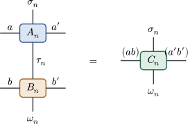
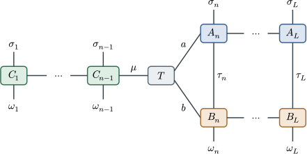
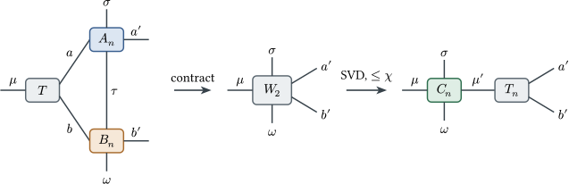
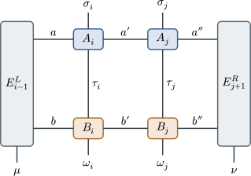

# MPO-MPO Contraction: Cost Analysis

This guide derives the floating-point cost (FLOPs) of contracting two MPOs on a
tensor train and compares four strategies: the naive product followed by
compression, the zip-up algorithm, the variational fit algorithm, and
successive randomized compression (SRC). It follows
the reference implementations in `tensor4all-treetn`:

- zip-up: `crates/tensor4all-treetn/src/treetn/contraction.rs`
  (`contract_zipup_chain`)
- fit: `crates/tensor4all-treetn/src/treetn/fit.rs` (two-site updates only, with
  the sweep plan built with `nsite=2` in `localupdate.rs`)
- SRC: `crates/tensor4all-treetn/src/treetn/contraction.rs`
  (`ContractionMethod::Src`)

The treetn crate handles general tree topologies. Here we specialize to a chain
(tensor train) so that the counting stays explicit.

## 1. Setup and notation

Consider two MPOs \\(A\\) and \\(B\\) of length \\(L\\) and their compressed
product \\(C \approx AB\\):

- physical (local) dimension: \\(d\\); each MPO carries two physical legs of
  dimension \\(d\\) per site,
- bond dimension of both inputs \\(A\\) and \\(B\\): \\(\chi\\),
- bond dimension of the output \\(C\\): truncated to \\(\chi\\),
- we assume the typical regime \\(\chi \ge d^2\\), which decides which side of
  each matrix factorization is the short one.

Site tensors and leg names:

We write \\(A_n[a,\sigma,\tau,a']\\) and \\(B_n[b,\tau,\omega,b']\\), and the
shared physical leg \\(\tau\\) of dimension \\(d\\) is contracted. The exact
product has bond dimension \\(\chi^2\\); compressing it back to \\(\chi\\) is
the whole problem.

### How we count FLOPs

- One multiply plus one add counts as 2 FLOPs.
- Every contraction is reduced to a GEMM: an \\((m \times k)(k \times n)\\)
  matrix product costs \\(2mkn\\) FLOPs, that is, "number of output elements
  times the product of the contracted dimensions times 2".
- Householder QR of an \\(m \times n\\) matrix with \\(m \ge n\\):
  \\(2mn^2 - \tfrac{2}{3}n^3 \approx 2mn^2\\) FLOPs.
- Thin SVD of an \\(m \times n\\) matrix with \\(m \le n\\): \\(O(m^2 n)\\)
  FLOPs. The constant is implementation dependent, so we use only the order.

## 2. Reference: naive contraction plus compression

As a baseline, form the exact product first and compress afterwards.

**Per-site product** (contract \\(\tau\\); the output carries
\\((ab)\, \sigma\, \omega\, (a'b')\\), that is \\(d^2\chi^4\\) elements):

\\[ 2 \cdot d^2\chi^4 \cdot d = 2d^3\chi^4 \ \text{FLOPs/site} \\]

**Compression**: canonicalize the MPO of bond dimension \\(D = \chi^2\\), then
truncate. The QR in the orthogonalization sweep acts on
\\((d^2\chi^2) \times (\chi^2)\\) matrices, so

\\[ 2 (d^2\chi^2)(\chi^2)^2 = 2d^2\chi^6 \ \text{FLOPs/site} \\]

This term dominates, giving the total

\\[ T_{\text{naive}} \approx 2Ld^2\chi^6 . \\]

Memory is heavy as well: the intermediate MPO stores \\(d^2\chi^4\\) elements
per tensor. Reducing the \\(\chi^6\\) scaling to \\(\chi^4\\) is exactly what
zip-up and fit are for.

## 3. Zip-up

Zip-up sweeps once from left to right, contracting and truncating at every site
(Stoudenmire and White, New J. Phys. 12, 055026 (2010), appendix). The
remainder tensor of `contract_zipup_chain` is the carry \\(T\\) below.

### Step Z0: preprocessing of the operands (QR canonicalization)

The treetn implementation first QR-canonicalizes \\(A\\) and \\(B\\) towards the
sweep start site, which keeps the remainder well conditioned. A TT QR sweep
factorizes a \\((d^2\chi) \times \chi\\) matrix at each site, so

\\[ 2 (d^2\chi) \chi^2 = 2d^2\chi^3 \\]

FLOPs per site and per operand,

subleading by a factor \\(1/\chi\\) relative to the \\(\chi^4\\) steps below.
Multiplying the \\(R\\) factor into the neighboring site is of the same
\\(O(d^2\chi^3)\\) order.

### Invariant

Before processing site \\(n\\) we hold a carry \\(T_{n-1}[\mu, a, b]\\), where
\\(\mu\\) is the already truncated new bond (\\(\le \chi\\)) and \\(a\\),
\\(b\\) are the unprocessed bonds of \\(A\\) and \\(B\\) (each of dimension
\\(\chi\\)). The initial carry is the \\(1\times1\times1\\) scalar one.

One full step, where Z1 and Z2 form the contraction and Z3 is the truncated
factorization:

### Step Z1: absorb \\(A_n\\) into the carry (contract \\(a\\))

\\[ W_1[\mu,\sigma,\tau,a',b] = \sum_a T[\mu,a,b]\, A_n[a,\sigma,\tau,a'] \\]

GEMM shape: \\((\mu b) \times a \times (\sigma\tau a')
= \chi^2 \times \chi \times d^2\chi\\).

\\[ \text{FLOPs}_{Z1} = 2 d^2 \chi^4 , \quad \text{output size } d^2\chi^3 \\]

### Step Z2: absorb \\(B_n\\) (contract \\(\tau\\) and \\(b\\) together)

\\[ W_2[\mu,\sigma,\omega,a',b'] = \sum_{\tau,b}
   W_1[\mu,\sigma,\tau,a',b]\, B_n[b,\tau,\omega,b'] \\]

GEMM shape: \\((\mu\sigma a') \times (\tau b) \times (\omega b')
= d\chi^2 \times d\chi \times d\chi\\).

\\[ \text{FLOPs}_{Z2} = 2 d^3 \chi^4 , \quad \text{output size } d^2\chi^3 \\]

The contraction order matters. Absorbing \\(B\\) first costs the same
\\(2d^3\chi^4\\), but contracting \\(T\\), \\(A_n\\) and \\(B_n\\) as a single
ternary contraction costs \\(2d^3\chi^5\\), which is a loss. Splitting into two
GEMMs is the correct choice. The implementation passes
`T::contract(&[remainder, tensor_a, tensor_b])` to the multi-tensor planner, and
the planner choosing this pairwise order is a precondition for the
\\(\chi^4\\) scaling.

### Step Z3: truncate by QR and build the new carry

Reshape \\(W_2\\) into a matrix

\\[ M[(\mu\sigma\omega),\ (a'b')] , \quad m = d^2\chi \ \text{rows}, \
   n = \chi^2 \ \text{columns} . \\]

Since \\(\chi \ge d^2\\) we have \\(m \le n\\). The truncation to rank
\\(\chi\\) is performed as "QR preprocessing plus a small SVD":

1. **LQ decomposition** (a QR of \\(M^\dagger\\)): \\(M = \tilde{L} Q\\) with
   \\(Q\\) a \\(d^2\chi \times \chi^2\\) row-orthonormal matrix. Cost
   \\(\approx 2 n m^2 = 2\chi^2 (d^2\chi)^2 = 2d^4\chi^4\\).
2. **Small SVD**: factorize \\(\tilde{L}\\), of size
   \\(d^2\chi \times d^2\chi\\), and keep the leading \\(\chi\\) singular
   values. Cost \\(O(d^6\chi^3)\\), subleading for \\(\chi \gg d\\).
3. Reshape the left factor \\(U\\) (\\(d^2\chi \times \chi\\)) into
   \\(C_n[\mu,\sigma,\omega,\mu']\\), and carry the remainder
   \\(\Sigma V^\dagger Q\\) (\\(\chi \times \chi^2\\)) forward as
   \\(T_n[\mu',a',b']\\). Forming that product costs
   \\(2\chi (d^2\chi) \chi^2 = 2d^2\chi^4\\).

\\[ \text{FLOPs}_{Z3} \approx 2 d^4 \chi^4 \\]

Applying a thin SVD directly to \\(M\\) has the same \\(O(d^4\chi^4)\\) order
but with a larger constant. Collapsing to a small square matrix by QR first and
only then running the SVD is exactly the two-stage construction above. In the
implementation this truncation is carried out by `factorize`
(`FactorizeOptions` with SVD and `max_bond_dim`; QR-flavored variants via
`with_qr_rtol`).

### Zip-up total

Per site,

\\[ 2\left(d^4 + d^3 + 2d^2\right)\chi^4 \approx 2d^4\chi^4 , \\]

dominated by the factorization (Z3). Over the whole chain,

\\[ T_{\text{zip}} \approx 2Ld^4\chi^4 . \\]

Peak memory is the \\(d^2\chi^3\\) elements of \\(W_2\\). The ratio to the naive
method is \\(T_{\text{naive}}/T_{\text{zip}} \approx \chi^2/d^2\\), a large win
for \\(\chi \gg d\\).

One caveat: at the moment of truncation the environment on the right has not
been contracted yet, because the carry \\(T\\) still sits there, so the cut is
not the optimal one in the canonical gauge. The error is therefore
quasi-optimal, and when strict error control is needed the standard practice is
to use the zip-up result as the initial guess for a fit.

## 4. Fit (variational)

Fit solves \\(\min_C \| C - AB \|^2\\) by ALS sweeps of DMRG type, updating
\\(C\\) locally while keeping it in mixed canonical form. Thanks to the
orthogonality of \\(C\\), each local update reduces to a projection through the
environment tensors, with no normal equations to solve.

The treetn `fit.rs` uses **two-site updates only**: `LocalUpdateSweepPlan` is
generated with `nsite=2` fixed and `FitUpdater` assumes `nsite=2`, which allows
adapting the bond dimension. The initial guess is the zip-up result, or a random
tensor train. Below we first derive the one-site version, whose cost structure is
easier to read off. That is a theoretical reference point only: treetn has no
one-site fit implementation. The two-site version, as implemented, follows.

### Environment tensors

The left environment \\(E^L_n[\mu, a, b]\\) contracts sites \\(1..n\\) of
\\(\bar{C}\\), \\(A\\) and \\(B\\); the right environment
\\(E^R_n[\nu, a, b]\\) is the mirror image. Here \\(\mu\\) and \\(\nu\\) are
bonds of \\(C\\), of dimension \\(\le \chi\\). In the implementation these are
the per-edge `env[(from, to)]` tensors of shape link_A by link_B by link_C.

### Updating an environment by one site

Compute \\(E^L_n = \sum \bar{C}_n A_n B_n E^L_{n-1}\\) in this order.

**Step E1**: absorb \\(\bar{C}_n\\) into \\(E^L_{n-1}\\) (contract \\(\mu\\)).
GEMM \\((ab) \times \mu \times (\sigma\omega\mu')
= \chi^2 \times \chi \times d^2\chi\\), so \\(2d^2\chi^4\\) FLOPs.

**Step E2**: absorb \\(A_n\\) (contract \\(a\\) and \\(\sigma\\)). GEMM
\\((\omega\mu' b) \times (a\sigma) \times (\tau a')
= d\chi^2 \times d\chi \times d\chi\\), so \\(2d^3\chi^4\\) FLOPs.

**Step E3**: absorb \\(B_n\\) (contract \\(b\\), \\(\tau\\) and \\(\omega\\)).
GEMM \\((\mu' a') \times (b\tau\omega) \times (b')
= \chi^2 \times d^2\chi \times \chi\\), so \\(2d^2\chi^4\\) FLOPs.

Total per environment update: \\(2(d^3 + 2d^2)\chi^4 \approx 2d^3\chi^4\\).

### Local update, one-site version

With the orthogonality center at site \\(n\\), the new tensor is exactly the
projection sandwiched between the environments:

\\[ C_n^{\text{new}}[\mu,\sigma,\omega,\nu] = \sum_{a,b,a',b',\tau}
   E^L_{n-1}[\mu,a,b]\, A_n[a,\sigma,\tau,a']\, B_n[b,\tau,\omega,b']\,
   E^R_{n+1}[\nu,a',b'] \\]

**Step U1**: \\(E^L_{n-1} \times A_n\\) (contract \\(a\\)). Same shape as
zip-up Z1, so \\(2d^2\chi^4\\).

**Step U2**: \\(\times B_n\\) (contract \\(\tau\\) and \\(b\\)). Same shape as
Z2, so \\(2d^3\chi^4\\). The output is \\(Y[\mu,\sigma,\omega,a',b']\\) of size
\\(d^2\chi^3\\).

**Step U3**: \\(\times E^R_{n+1}\\) (contract \\(a'\\) and \\(b'\\)). GEMM
\\((\mu\sigma\omega) \times (a'b') \times \nu
= d^2\chi \times \chi^2 \times \chi\\), so \\(2d^2\chi^4\\).

Total for the local update: \\(2(d^3 + 2d^2)\chi^4 \approx 2d^3\chi^4\\).

**Moving the center**: treat \\(C_n^{\text{new}}\\) as a
\\((d^2\chi) \times \chi\\) matrix, QR it, fix \\(Q\\) as \\(C_n\\) and
multiply \\(R\\) into the right neighbor. Cost
\\(2(d^2\chi)\chi^2 = 2d^2\chi^3\\), subleading.

### Savings from reuse

In a rightward sweep the output \\(Y[\mu,\sigma,\omega,a',b']\\) of U2 can be
reused directly for the environment update:

\\[ E^L_n[\mu',a',b'] = \sum_{\mu,\sigma,\omega}
   \bar{Q}_n[\mu,\sigma,\omega,\mu']\, Y[\mu,\sigma,\omega,a',b'] \\]

This is a GEMM \\(\mu' \times (d^2\chi) \times \chi^2\\) costing
\\(2d^2\chi^4\\). E1 and E2 therefore never need to be redone independently, and
one site of work, namely U1 plus U2 plus U3 plus the QR plus the environment
assembly, costs

\\[ 2\left(d^3 + 3d^2\right)\chi^4 + O(d^2\chi^3) \approx 2d^3\chi^4
   \ \text{FLOPs/site} . \\]

### One-site total

One half sweep in a single direction costs \\(\approx 2Ld^3\chi^4\\). Building
the initial environments once, that is all environments on one side, costs the
same \\(\approx 2Ld^3\chi^4\\). With \\(n_{\text{sw}}\\) half sweeps,

\\[ T_{\text{fit,1site}} \approx 2\,(n_{\text{sw}}+1)\,L\,d^3\chi^4 . \\]

### Two-site update (the treetn default)

The pair \\((i, j = i{+}1)\\) is updated at once:

\\[ \Theta[\mu,\sigma_i,\omega_i,\sigma_j,\omega_j,\nu] =
   E^L_{i-1} \cdot A_i B_i \cdot A_j B_j \cdot E^R_{j+1} \\]

The efficient order works from both ends toward the middle.

**Step V1**: \\(Y = E^L_{i-1} A_i B_i\\), identical to U1 plus U2, costing
\\(2(d^2{+}d^3)\chi^4\\), with output \\(Y[\mu,\sigma_i,\omega_i,a',b']\\) of
size \\(d^2\chi^3\\).

**Step V2**: \\(Z = E^R_{j+1} A_j B_j\\), the mirror image, costing
\\(2(d^2{+}d^3)\chi^4\\), with output \\(Z[\nu,\sigma_j,\omega_j,a',b']\\). In a
rightward sweep, \\(Z\\) has already been built once, at \\(O(d^3\chi^4)\\),
from the per-edge environment cache created during initialization.

**Step V3**: \\(\Theta = Y \cdot Z\\) (contract \\(a'\\) and \\(b'\\)). GEMM

\\[ (\mu\sigma_i\omega_i) \times (a'b') \times (\nu\sigma_j\omega_j)
   = d^2\chi \times \chi^2 \times d^2\chi \\]

so

\\[ \text{FLOPs}_{V3} = 2d^4\chi^4 . \\]

This is the dominant term of the two-site version. The central \\(\chi^2\\) is
contracted while \\(d^2\\) physical legs are still carried on each side, which
is what raises \\(d^4\\).

**Step V4**: SVD \\(\Theta\\) as a \\((d^2\chi) \times (d^2\chi)\\) matrix and
cut at \\(\chi\\). Cost \\(O(d^6\chi^3)\\), subleading when
\\(\chi \ge d^2\\). The left factor is fixed as \\(C_i\\) and the
\\(\Sigma V^\dagger\\) side becomes \\(C_j\\).

**Environment update**: from \\(Y\\) and the fixed \\(\bar{C}_i\\),
\\(E^L_i = \sum_{\mu\sigma\omega} \bar{C}_i Y\\), a GEMM
\\(\chi \times d^2\chi \times \chi^2\\) costing \\(2d^2\chi^4\\).

One step costs \\(\approx 2(d^4 + 2d^3 + \cdots)\chi^4\\), and a half sweep has
\\(L{-}1\\) steps, so

\\[ T_{\text{fit,2site}} \approx 2\,n_{\text{sw}}\,L\,d^4\chi^4
   \ (+\ 2Ld^3\chi^4 \ \text{for the initial environments}) . \\]

In other words, **one half sweep of two-site fit costs about the same as one
zip-up pass**, both leading with \\(2Ld^4\chi^4\\). The one-site version is
cheaper by a factor of \\(d\\), but the two-site version is chosen for its bond
dimension adaptation and for how much more easily it escapes local minima.

## 5. Successive randomized compression (SRC)

SRC compresses the exact local MPO-MPO product through a randomized range
finder. At each directed tree edge, the implementation contracts the component
on the far side of the edge into a set of Gaussian probe environments. The
local product is sketched with those environments, QR-factorized, and projected
onto the retained range before the result is passed to the next edge. A
postorder pass constructs child-to-parent environments; a preorder pass adds
the complementary parent-to-child environments, so a branch sees the complete
tree context rather than only its local bond.

`SrcOptions::fixed()` uses a deterministic seeded Gaussian sketch at the
requested rank. `SrcOptions::adaptive(rtol, max_rank)` grows the sketch in
blocks and uses the triangular factor from QR to estimate the residual. The
estimate is used to stop at the requested relative tolerance, while
`max_rank` remains a hard safety cap. The optional final SVD is useful when the
SRC range is deliberately overcomplete; enable it with `final_svd(true)`. When
`final_svd` is enabled together with an adaptive `rtol` and a final truncation
policy that carries its own tolerance, the sketch stopping test tightens to
one tenth of `SrcOptions::rtol` — the adaptive SRC tolerance the caller
supplied, *not* the final SVD truncation policy's own threshold. The two
tolerances are independent and are not currently reconciled if a caller sets
them to different values, so keep them consistent by hand when tuning both.

The public placement is alongside `naive`, `zip-up`, and `fit` in
`ContractionMethod`. It is implemented in TreeTN first, which also covers a
chain, so SimpleTT does not maintain a second independent SRC implementation.
The itensorlike `TensorTrain` bridge and `ApplyOptions` expose the same method.

SRC has a different cost profile from the deterministic methods. Its leading
work is the cost of forming the directed environment sketches plus QR of the
local sketched products; for a chain this reduces to the two-sided environments
and successive local range finding described in the SRC reference. The exact
cost depends on the retained rank, sketch oversampling, and tree degrees, so a
single `L d^p chi^q` expression would hide the main trade-off. The Gaussian
probes are reproducible through `SrcOptions::with_seed` and should be held
fixed when comparing implementations.

## 6. Summary and comparison

| method | FLOPs (leading) | passes | peak memory | truncation quality |
|---|---|---|---|---|
| SRC (TreeTN) | environment sketches plus QR | 1 postorder plus 1 preorder | directed probe environments | randomized, tolerance-controlled |
| naive plus SVD | \\(2Ld^2\chi^6\\) | 1 plus compression sweeps | \\(d^2\chi^4\\) per tensor | optimal (canonical gauge) |
| zip-up | \\(2Ld^4\chi^4\\) | 1 | \\(d^2\chi^3\\) | quasi-optimal (environment not contracted) |
| fit, one-site (theoretical reference) | \\(2(n_{\text{sw}}+1)Ld^3\chi^4\\) | \\(n_{\text{sw}}\\) | \\(\chi^3\\) (environments) | monotone improvement per sweep |
| fit, two-site (treetn implementation) | \\(2n_{\text{sw}}Ld^4\chi^4\\) | \\(n_{\text{sw}}\\) | \\(d^2\chi^3\\) | monotone improvement plus \\(\chi\\) adaptation |

- **Naive versus zip-up**: the ratio is \\(\chi^2/d^2\\). In the practical
  regime \\(\chi \gg d\\), zip-up wins by a wide margin.
- **Zip-up versus fit**: a one-site fit is cheaper per half sweep by a factor of
  \\(d\\). Its \\(d^3\chi^4\\) term comes from a contraction (U2), while its
  factorizations only reach the \\(\chi^3\\) level, whereas zip-up pays for a
  factorization of a \\(d^2\chi \times \chi^2\\) matrix (\\(d^4\chi^4\\)) at
  every site. The two-site fit raises \\(d^4\chi^4\\) in the central-bond
  contraction (V3) and thus costs the same as one zip-up pass.
- The treetn default pipeline is exactly the standard recipe: **build an initial
  guess with zip-up, then run a few two-site fit sweeps**. The total is
  \\(\approx 2(n_{\text{sw}}+1)Ld^4\chi^4\\), which never touches a
  \\(\chi^6\\) step yet delivers canonical-gauge quality truncation together
  with bond dimension adaptation.
- Where the powers of \\(d\\) come from, in one line: \\(d^2\\) is the "area" of
  the two physical legs, \\(d^3\\) adds the shared leg \\(\tau\\), and
  \\(d^4\\) appears when a block carrying \\(d^2\\) physical legs sits on both
  sides of a factorization (zip-up Z3) or of a contraction (two-site fit V3).

## Appendix: assumptions and variants

- If \\(\chi < d^2\\), the matrix in Z3 becomes tall and the factorization cost
  changes to \\(2(d^2\chi)\chi^4 = 2d^2\chi^5\\), using the \\(m > n\\) branch
  of the QR formula.
- If the input and output bond dimensions are distinguished (\\(\chi_A\\),
  \\(\chi_B\\), output \\(\chi_C\\)), the counts generalize to
  \\(2d^2\chi_C\chi_A^2\chi_B\\) for Z1,
  \\(2d^3\chi_C\chi_A\chi_B^2\\) for Z2,
  \\(2(d^2\chi_C)^2\chi_A\chi_B\\) for Z3, and
  \\(2d^3\chi_C\chi_A\chi_B\max(\chi_A,\chi_B)\\) for the fit step U2. The main
  text is the specialization \\(\chi_A = \chi_B = \chi_C = \chi\\).
- Only multiply-adds are counted. The iterative part of the SVD and memory
  bandwidth are excluded. Since GEMM-friendly contractions dominate, in practice
  the low effective efficiency of the factorization steps (LAPACK) often makes
  zip-up look worse than the theoretical ratios suggest.

The figures are generated with Typst and cetz; the sources live in
`docs/book/figures-src/mpo-contraction/`.
